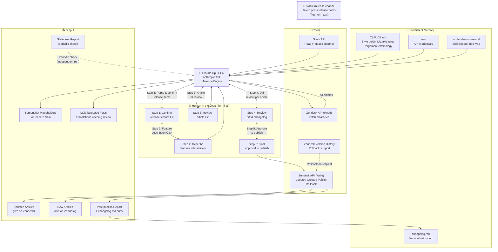

# Pergamon Docs Agent — Architecture



---

## Layer Breakdown

### 🧠 Inference — Claude Opus 4.6
The brain. Reads inputs, reasons about what needs updating, drafts content, manages the conversation flow with the user.

### 💾 Memory — Persistent Files
| File | Purpose |
|---|---|
| `CLAUDE.md` | Always-on style guide, Diataxis rules, Pergamon terminology |
| `.env` | API credentials — Slack, Zendesk, Anthropic |
| `changelog.md` | Running log of all releases and doc changes |
| `~/.claude/commands/` | Skill files per Diataxis doc type |

### 🔧 Tools — External APIs
| Tool | Action |
|---|---|
| Slack API | Read #release channel threads |
| Zendesk API (Read) | Fetch all articles and version history |
| Zendesk API (Write) | Update, create, publish, rollback articles |

### 👤 Human in the Loop — Terminal
5 checkpoints where the user must confirm before the agent proceeds. Nothing is published without explicit approval.

### 📤 Output
- Updated articles live on Zendesk
- New articles live on Zendesk
- Post-publish report in terminal
- Changelog entry logged to file
- Screenshot placeholders for the team
- Multi-language flags for translation team
- Staleness reports (periodic, independent)
```
