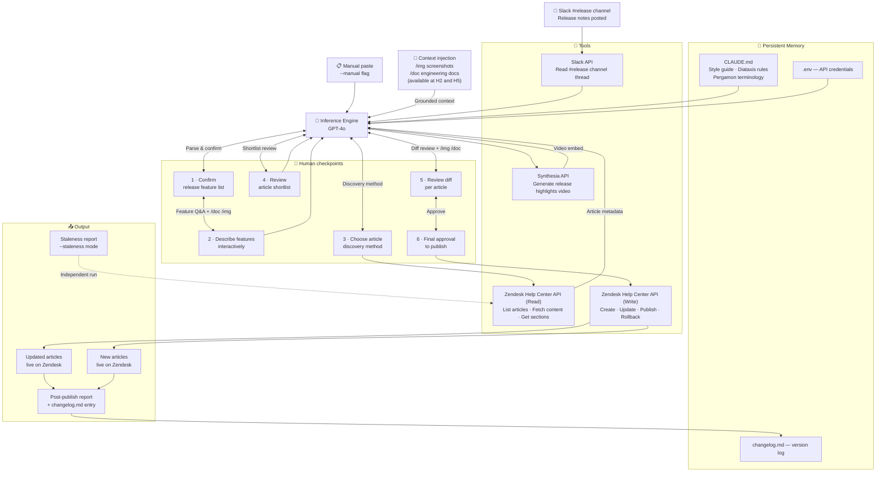
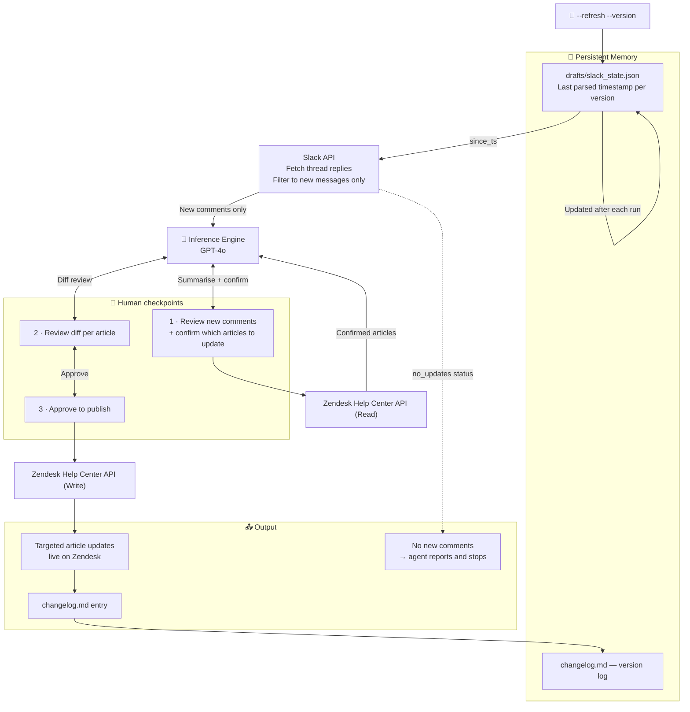
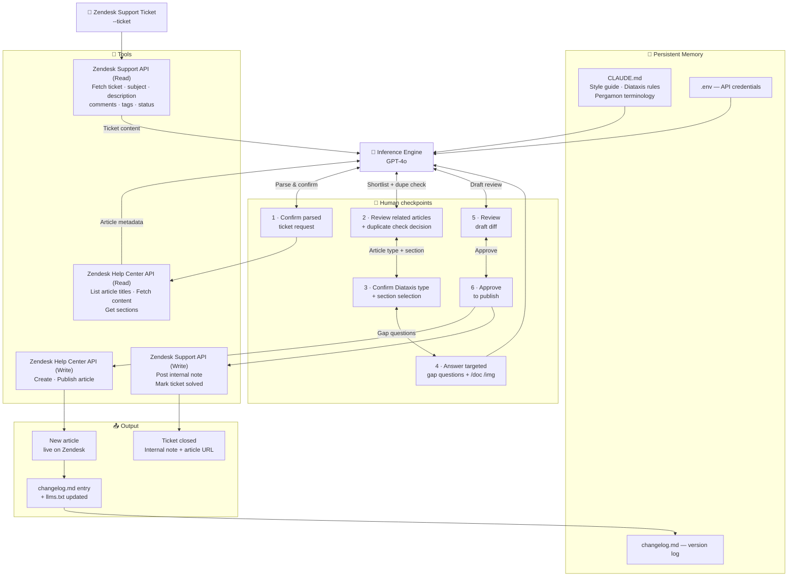
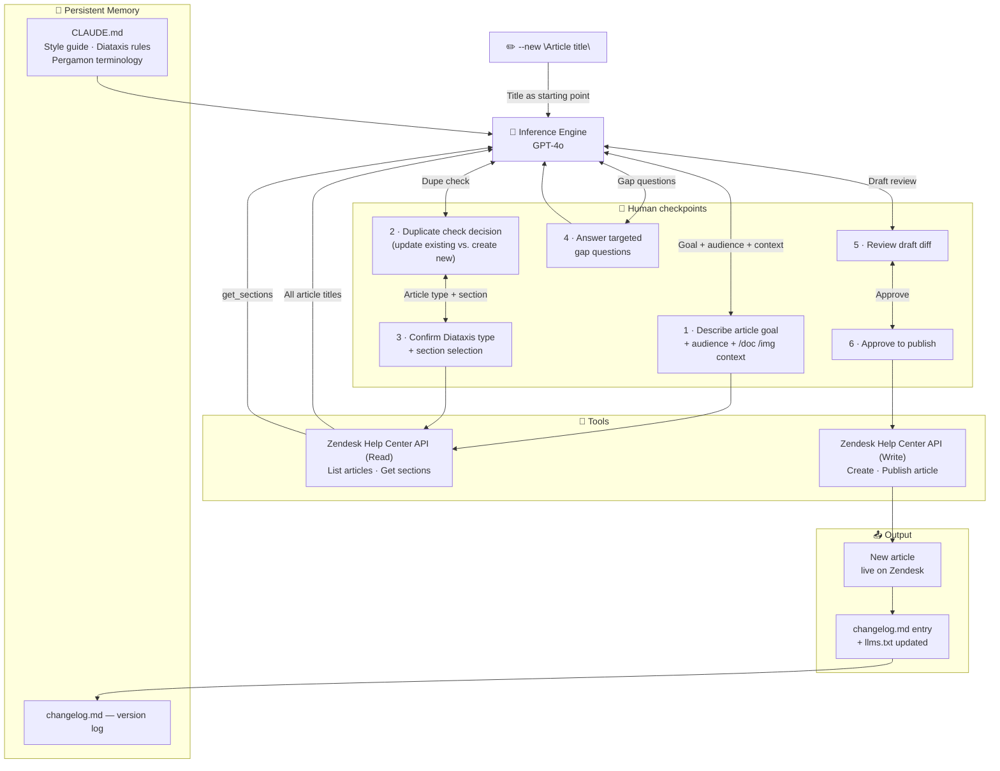

# Pergamon Docs Agent — Architecture

Three independent workflows share the same inference engine, tool layer, and human checkpoint pattern. Choose the entry point based on the trigger.

---

## Workflow 1 — Release documentation update

Triggered after every product release. Reads from Slack, audits the knowledge base, drafts updates and release notes, and publishes after approval.

```mermaid
flowchart TD
    SLACK["📢 Slack #release channel\nRelease notes posted"]
    MANUAL["📋 Manual paste\n--manual flag"]

    CLAUDE["🧠 Inference Engine\nGPT-4o"]

    subgraph MEMORY["💾 Persistent Memory"]
        CM["CLAUDE.md\nStyle guide · Diataxis rules\nPergamon terminology"]
        ENV[".env — API credentials"]
        CL["changelog.md — version log"]
    end

    subgraph TOOLS["🔧 Tools"]
        SLACK_TOOL["Slack API\nRead #release channel thread"]
        ZD_READ["Zendesk Help Center API (Read)\nList articles · Fetch content · Get sections"]
        ZD_WRITE["Zendesk Help Center API (Write)\nCreate · Update · Publish · Rollback"]
        SYNTHESIA["Synthesia API\nGenerate release highlights video"]
    end

    subgraph CHECKPOINTS["👤 Human checkpoints"]
        H1["1 · Confirm\nrelease feature list"]
        H2["2 · Describe features\ninteractively"]
        H3["3 · Choose article\ndiscovery method"]
        H4["4 · Review\narticle shortlist"]
        H5["5 · Review diff\nper article"]
        H6["6 · Final approval\nto publish"]
    end

    INJECT["💉 Context injection\n/img screenshots\n/doc engineering docs\n(available at H2 and H5)"]

    subgraph OUTPUT["📤 Output"]
        UP["Updated articles\nlive on Zendesk"]
        NEW["New articles\nlive on Zendesk"]
        REPORT["Post-publish report\n+ changelog.md entry"]
        STALE["Staleness report\n--staleness mode"]
    end

    SLACK --> SLACK_TOOL --> CLAUDE
    MANUAL --> CLAUDE
    CM & ENV --> CLAUDE
    INJECT -->|"Grounded context"| CLAUDE

    CLAUDE <-->|"Parse & confirm"| H1
    H1 <-->|"Feature Q&A + /doc /img"| H2
    H2 --> CLAUDE
    CLAUDE <-->|"Discovery method"| H3
    H3 --> ZD_READ -->|"Article metadata"| CLAUDE
    CLAUDE <-->|"Shortlist review"| H4
    H4 --> CLAUDE
    CLAUDE --> SYNTHESIA -->|"Video embed"| CLAUDE
    CLAUDE <-->|"Diff review + /img /doc"| H5
    H5 <-->|"Approve"| H6
    H6 --> ZD_WRITE --> UP & NEW --> REPORT --> CL

    STALE -.->|"Independent run"| ZD_READ
```

---

## Workflow 2 — Slack thread refresh

Triggered when new comments are added to an already-processed Slack release thread — stakeholder clarifications, corrections, or additions. Fetches only new messages since the last run and does a targeted update.

```mermaid
flowchart TD
    CMD["🔄 --refresh --version <ver>"]

    subgraph MEMORY["💾 Persistent Memory"]
        STATE["drafts/slack_state.json\nLast parsed timestamp per version"]
        CL["changelog.md — version log"]
    end

    SLACK_TOOL["Slack API\nFetch thread replies\nFilter to new messages only"]
    CLAUDE["🧠 Inference Engine\nGPT-4o"]
    ZD_READ["Zendesk Help Center API (Read)"]
    ZD_WRITE["Zendesk Help Center API (Write)"]

    subgraph CHECKPOINTS["👤 Human checkpoints"]
        R1["1 · Review new comments\n+ confirm which articles to update"]
        R2["2 · Review diff per article"]
        R3["3 · Approve to publish"]
    end

    subgraph OUTPUT["📤 Output"]
        UP["Targeted article updates\nlive on Zendesk"]
        REPORT["changelog.md entry"]
        NONE["No new comments\n→ agent reports and stops"]
    end

    CMD --> STATE -->|"since_ts"| SLACK_TOOL
    SLACK_TOOL -->|"New comments only"| CLAUDE
    SLACK_TOOL -.->|"no_updates status"| NONE
    STATE -->|"Updated after each run"| STATE

    CLAUDE <-->|"Summarise + confirm"| R1
    R1 --> ZD_READ -->|"Confirmed articles"| CLAUDE
    CLAUDE <-->|"Diff review"| R2
    R2 <-->|"Approve"| R3
    R3 --> ZD_WRITE --> UP --> REPORT --> CL
```

---

## Workflow 3 — Ticket-driven article creation

Triggered by a Zendesk support ticket number. Reads the ticket, researches the knowledge base for context and duplicate detection, gathers structured input, drafts a compliant article, publishes it, and closes the ticket with an internal note.

```mermaid
flowchart TD
    TICKET_IN["🎫 Zendesk Support Ticket\n--ticket <id>"]

    CLAUDE["🧠 Inference Engine\nGPT-4o"]

    subgraph MEMORY["💾 Persistent Memory"]
        CM["CLAUDE.md\nStyle guide · Diataxis rules\nPergamon terminology"]
        ENV[".env — API credentials"]
        CL["changelog.md — version log"]
    end

    subgraph TOOLS["🔧 Tools"]
        ZD_TICKET_R["Zendesk Support API (Read)\nFetch ticket · subject · description\ncomments · tags · status"]
        ZD_READ["Zendesk Help Center API (Read)\nList article titles · Fetch content\nGet sections"]
        ZD_WRITE["Zendesk Help Center API (Write)\nCreate · Publish article"]
        ZD_TICKET_W["Zendesk Support API (Write)\nPost internal note\nMark ticket solved"]
    end

    subgraph CHECKPOINTS["👤 Human checkpoints"]
        T1["1 · Confirm parsed\nticket request"]
        T2["2 · Review related articles\n+ duplicate check decision"]
        T3["3 · Confirm Diataxis type\n+ section selection"]
        T4["4 · Answer targeted\ngap questions + /doc /img"]
        T5["5 · Review\ndraft diff"]
        T6["6 · Approve\nto publish"]
    end

    subgraph OUTPUT["📤 Output"]
        NEW["New article\nlive on Zendesk"]
        TICKET_CLOSE["Ticket closed\nInternal note + article URL"]
        REPORT["changelog.md entry\n+ llms.txt updated"]
    end

    TICKET_IN --> ZD_TICKET_R -->|"Ticket content"| CLAUDE
    CM & ENV --> CLAUDE

    CLAUDE <-->|"Parse & confirm"| T1
    T1 --> ZD_READ -->|"Article metadata"| CLAUDE
    CLAUDE <-->|"Shortlist + dupe check"| T2
    T2 <-->|"Article type + section"| T3
    T3 <-->|"Gap questions"| T4
    T4 --> CLAUDE
    CLAUDE <-->|"Draft review"| T5
    T5 <-->|"Approve"| T6
    T6 --> ZD_WRITE --> NEW --> REPORT --> CL
    T6 --> ZD_TICKET_W --> TICKET_CLOSE
```

---

## Workflow 4 — Ad-hoc new article

Triggered directly by the user with an article title. No Slack release and no support ticket required. For one-off documentation needs — new features, missing guides, or any article the user decides to write independently.

```mermaid
flowchart TD
    CMD["✏️ --new \"Article title\""]
    CLAUDE["🧠 Inference Engine\nGPT-4o"]

    subgraph MEMORY["💾 Persistent Memory"]
        CM["CLAUDE.md\nStyle guide · Diataxis rules\nPergamon terminology"]
        CL["changelog.md — version log"]
    end

    subgraph TOOLS["🔧 Tools"]
        ZD_READ["Zendesk Help Center API (Read)\nList articles · Get sections"]
        ZD_WRITE["Zendesk Help Center API (Write)\nCreate · Publish article"]
    end

    subgraph CHECKPOINTS["👤 Human checkpoints"]
        N1["1 · Describe article goal\n+ audience + /doc /img context"]
        N2["2 · Duplicate check decision\n(update existing vs. create new)"]
        N3["3 · Confirm Diataxis type\n+ section selection"]
        N4["4 · Answer targeted\ngap questions"]
        N5["5 · Review draft diff"]
        N6["6 · Approve to publish"]
    end

    subgraph OUTPUT["📤 Output"]
        NEW["New article\nlive on Zendesk"]
        REPORT["changelog.md entry\n+ llms.txt updated"]
    end

    CMD -->|"Title as starting point"| CLAUDE
    CM --> CLAUDE

    CLAUDE <-->|"Goal + audience + context"| N1
    N1 --> ZD_READ -->|"All article titles"| CLAUDE
    CLAUDE <-->|"Dupe check"| N2
    N2 <-->|"Article type + section"| N3
    N3 --> ZD_READ -->|"get_sections"| CLAUDE
    CLAUDE <-->|"Gap questions"| N4
    N4 --> CLAUDE
    CLAUDE <-->|"Draft review"| N5
    N5 <-->|"Approve"| N6
    N6 --> ZD_WRITE --> NEW --> REPORT --> CL
```

---

## Layer breakdown

### 🧠 Inference — GPT-4o
Reads inputs, reasons about what to write, drafts HTML, manages the conversation flow with the user across all checkpoints. Engineering docs are translated to end-user language — implementation details are stripped before drafting.

### 💾 Memory — Persistent files

| File | Purpose |
|---|---|
| `CLAUDE.md` | Always-on style guide, Diataxis rules, Pergamon terminology, AEO rules |
| `.env` | API credentials — Slack, Zendesk, OpenAI, Synthesia |
| `changelog.md` | Running log of all published doc changes |
| `llms.txt` | AI-crawler index of the help center — updated after every publish |
| `drafts/slack_state.json` | Last-parsed Slack thread timestamp per version — enables refresh workflow |

### 🔧 Tools — External APIs

| Tool | Workflow | Action |
|---|---|---|
| Slack API (thread fetch) | Release | Read #release channel threads — by latest, version string, or date |
| Slack API (thread updates) | Refresh | Fetch only comments newer than last parsed timestamp |
| Zendesk Help Center API (Read) | Release · Refresh · Ticket | List articles, fetch content, list sections |
| Zendesk Help Center API (Write) | Release · Refresh · Ticket | Create, update, publish, rollback articles |
| Zendesk Support API (Read) | Ticket | Fetch ticket subject, description, comments, tags |
| Zendesk Support API (Write) | Ticket | Post internal note (never public), mark ticket solved |
| Synthesia API | Release | Generate release highlights video for release notes |

### 💉 Context injection — at any prompt

At any `ask_user` or diff review checkpoint the user can inject grounded context inline:

| Command | What it does |
|---|---|
| `/img path1, path2` | Loads screenshots as GPT-4o vision content blocks |
| `/doc path1, path2` | Loads engineering docs as text context — agent translates to end-user language |
| `/note message` | Injects a side note into the next agent message |

Multiple `/img` and `/doc` commands can appear in a single input. Supported doc formats: `.md` `.txt` `.rst` `.pdf` `.docx`. Backslash-escaped paths (`path\ with\ spaces`) are handled automatically.

### 👤 Human in the loop — Terminal

Every workflow enforces human checkpoints at every decision point. Nothing publishes without explicit approval via `request_publish_approval`. Additional guardrails:

- **Empty response guard** — `ask_user` re-prompts if the user submits an empty response
- **Premature stop recovery** — if the agent stops before calling `save_changelog_entry`, the loop automatically injects a continuation message and resumes (up to 3 times)
- **Slack thread targeting** — `--version` matches on version strings and date formats (e.g. `28.05.2026`); `--thread` accepts a Slack message permalink for exact targeting

### 📤 Output

| Output | Release | Refresh | Ticket |
|---|---|---|---|
| Updated articles live on Zendesk | ✓ | ✓ | — |
| New articles live on Zendesk | ✓ | — | ✓ |
| Post-publish report in terminal | ✓ | ✓ | ✓ |
| changelog.md entry | ✓ | ✓ | ✓ |
| llms.txt updated | ✓ | — | ✓ |
| Screenshot placeholders in articles | ✓ | ✓ | ✓ |
| Ticket closed with internal note | — | — | ✓ |
| Staleness report (--staleness) | ✓ | — | — |

---

## CLI reference

| Command | Description |
|---|---|
| `python3 main.py` | Release workflow — fetch latest thread from Slack |
| `python3 main.py --manual` | Release workflow — paste release notes manually |
| `python3 main.py --version <ver>` | Target a specific release version or date e.g. `3.9.0` or `28.05.2026` |
| `python3 main.py --refresh --version <ver>` | Refresh — re-parse thread for new comments since last run |
| `python3 main.py --ticket <id>` | Ticket workflow — create article from support ticket |
| `python3 main.py --staleness` | Staleness audit — flag articles not updated in 6+ months |
| `python3 main.py --months <n>` | Override staleness threshold (default: 6 months) |
| `python3 main.py --rollback <id>` | Rollback a specific article by Zendesk article ID |
