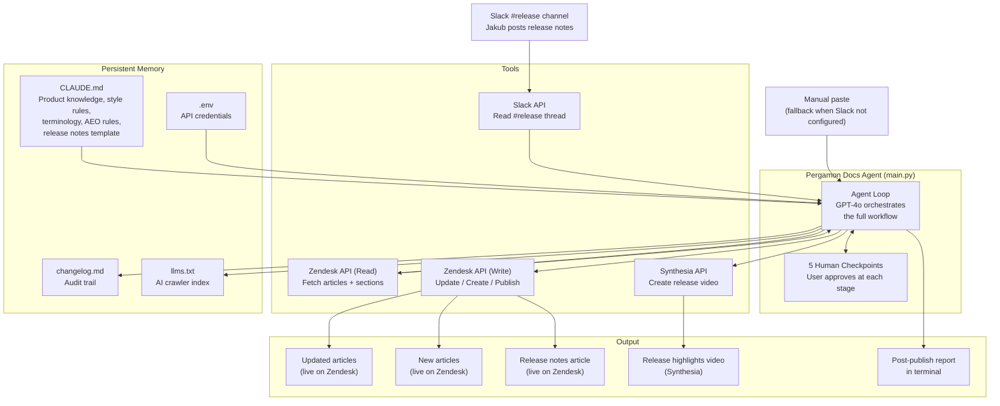

# Pergamon Docs Agent — Architecture

## Overview

The Pergamon Docs Agent is an AI-powered documentation automation system that monitors Slack for product release announcements and automatically updates, creates, and publishes Zendesk help articles — maintaining Pergamon's documentation standards, AEO compliance, and release notes format throughout.

It is built as a Python application running locally on a Mac, using the OpenAI GPT-4o model for intelligence and calling external APIs (Zendesk, Slack, Synthesia) as tools.

---

## System Diagram



---

## Two-Agent Architecture

The Pergamon system consists of two separate but connected agents:

| Agent | Location | Role |
|---|---|---|
| **Pergamon Docs Agent** | `/pergdocsagent/` | Orchestrator — handles articles, release notes, AEO, changelog, llms.txt |
| **Synthesia Video Agent** | `/synthesi/` | Specialist — called by Docs Agent via API, returns video URL |

The Docs Agent calls the Synthesia API directly using the key in `.env`. No separate process or script needs to be run.

---

## Component Breakdown

### 1. Intelligence Layer — GPT-4o (OpenAI)
The brain of the agent. Responsible for:
- Parsing free-form Slack release notes into structured feature lists
- Deciding which Zendesk articles are affected by a release
- Drafting article updates following Diataxis framework and Pergamon style
- Running AEO pass — TL;DR blocks, FAQ sections, schema markup
- Drafting release notes in Pergamon's standard format
- Managing the conversation flow with the user

**Model:** `gpt-4o`
**Provider:** OpenAI API
**Key:** `OPENAI_API_KEY` in `.env`

---

### 2. Tools Layer — External APIs

| Tool | File | What it does |
|---|---|---|
| `fetch_slack_release_thread` | `tools/slack.py` | Reads latest release thread from #release channel |
| `list_zendesk_articles` | `tools/zendesk.py` | Fetches all 194 article titles and metadata |
| `get_zendesk_article` | `tools/zendesk.py` | Fetches full HTML body of a specific article |
| `get_sections` | `tools/zendesk.py` | Lists all Zendesk sections with IDs |
| `update_zendesk_article` | `tools/zendesk.py` | Saves updated article as draft |
| `create_zendesk_article` | `tools/zendesk.py` | Creates a new article in a specified section |
| `publish_zendesk_article` | `tools/zendesk.py` | Publishes article live (draft: false) |
| `rollback_zendesk_article` | `tools/zendesk.py` | Flags article for rollback |
| `create_release_video` | `tools/synthesia.py` | Calls Synthesia API to create release video |
| `select_article_discovery_method` | `main.py` | Human checkpoint — user chooses how to find impacted articles |
| `ask_user` | `main.py` | Human checkpoint — agent asks user a question |
| `show_diff` | `main.py` | Human checkpoint — shows article changes for review |
| `request_publish_approval` | `main.py` | Human checkpoint — final gate before publishing |
| `save_changelog_entry` | `main.py` | Appends entry to changelog.md |
| `update_llms_txt` | `main.py` | Regenerates llms.txt after publish |

---

### 3. Memory Layer — Persistent Files

| File | Purpose | Updated by |
|---|---|---|
| `CLAUDE.md` | Product knowledge, Pergamon terminology, style guides, AEO rules, callout formats, release notes template, Diataxis templates | Manually by docs team |
| `.env` | API credentials for all integrations | Manually by admin |
| `changelog.md` | Full audit trail of every release processed | Agent after each publish |
| `llms.txt` | AI crawler index — tells GPTBot, ClaudeBot, Perplexity what Pergamon is and where docs live | Agent after each publish |
| `drafts/` | Local backup of articles that failed to publish | Agent on publish failure |

---

### 4. Human in the Loop — 5 Checkpoints

Nothing is published without explicit user approval. The agent pauses at five points:

| Checkpoint | Step | What the user does |
|---|---|---|
| Feature list confirmation | Step 2 | Confirms the parsed feature list is correct |
| Feature description Q&A | Step 3 | Describes how each feature works in plain language |
| Article discovery | Step 4 | Chooses how to find impacted articles (scan / section / direct IDs) |
| Diff review | Step 6 | Reviews proposed changes article by article (approve / skip / edit) |
| Publish approval | Step 7 | Final sign-off before anything goes live |

---

### 5. AEO Layer — AI Readability

Every article the agent writes or updates automatically receives:

| Enhancement | What it adds |
|---|---|
| TL;DR block | 2-3 sentence summary at the top — most likely part AI models cite |
| FAQ section | 3-5 natural language Q&A pairs at the bottom |
| Schema markup | `HowTo` or `FAQPage` JSON-LD injected into article HTML |
| Question-based headings | Vague headings rewritten as specific questions |
| Term definitions | Pergamon-specific terms defined on first use |

---

## Data Flow

```
1. Release notes (Slack or manual paste)
            ↓
2. GPT-4o parses → structured feature list
            ↓
3. User confirms feature list + describes each feature
            ↓
4. User chooses article discovery method
            ↓
5. Agent fetches only confirmed articles (not all 194)
            ↓
6. GPT-4o drafts updates + AEO pass + release notes
            ↓
7. Synthesia API → release video created
            ↓
8. User reviews diffs article by article
            ↓
9. User gives final approval
            ↓
10. Agent publishes to Zendesk (with retry logic)
            ↓
11. changelog.md + llms.txt updated
            ↓
12. Post-publish report in terminal
```

---

## Token Efficiency Design

The agent is designed to minimise API token consumption:

| Design decision | Why |
|---|---|
| Metadata-only scan for article discovery | Fetches titles only (~3K tokens) not full bodies |
| User confirms shortlist before full fetch | Full article bodies (~3K each) only fetched for confirmed articles |
| Three discovery modes | User can skip scanning entirely by providing article IDs directly |
| Sequential article processing | One article at a time — keeps context window manageable |
| CLAUDE.md is the only always-loaded context | No full knowledge base loaded on every run |

---

## Error Handling

| Error | Behaviour |
|---|---|
| Zendesk publish fails | Retries up to 3 times, saves draft locally to `/drafts/` if all fail |
| OpenAI rate limit (429) | Waits 60s per attempt, retries up to 5 times |
| OpenAI overloaded (529) | Waits 30s per attempt, retries up to 5 times |
| Synthesia video fails | Inserts `[VIDEO NEEDED]` placeholder, continues workflow |
| Slack not configured | Falls back to manual paste in terminal |
| Article not found | Agent warns user and skips |
